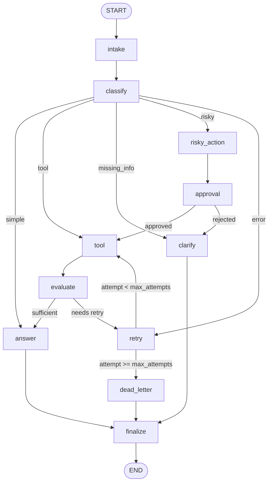

# Day 08 Lab Report - LangGraph Agentic Orchestration

## 1. Team / Student

- Name: Luong Trung Duc
- Repo/commit: local workspace submission
- Date: 2026-06-29

## 2. Architecture Summary

The workflow is a production-style support-ticket graph. It normalizes input, uses an LLM
structured-output classifier, routes by state, executes mock support tools when needed,
uses an LLM-as-judge gate for tool quality, handles bounded retries, gates risky actions
through HITL approval, and sends every branch through `finalize -> END`.

## 3. State Schema

State is intentionally lean and checkpoint-safe: only strings, numbers, booleans, dicts,
and lists are stored. Append-only reducers are used for audit trails; scalar fields are
overwritten by the node that owns them.

| Field | Reducer | Purpose |
|---|---|---|
| `query`, `route`, `risk_level` | overwrite | Current ticket and route decision |
| `classification` | overwrite | Structured LLM classification with confidence/rationale |
| `tool_results` | append | JSON-serializable mock tool outputs |
| `evaluation_result` | overwrite | LLM-as-judge retry gate |
| `pending_question` | overwrite | Clarification request for missing info |
| `proposed_action`, `approval` | overwrite | HITL approval context for risky actions |
| `attempt`, `max_attempts` | overwrite | Bounded retry control |
| `final_answer` | overwrite | Final user-facing response |
| `messages`, `errors`, `events` | append | Traceability, audit, and metrics |

## 4. Routing Table

| Route | Trigger | Next node |
|---|---|---|
| `simple` | General support question | `answer` |
| `tool` | Lookup/status/search needed | `tool -> evaluate` |
| `missing_info` | Vague or underspecified request | `clarify` |
| `risky` | Refund/delete/send/cancel or side effect | `risky_action -> approval` |
| `error` | Timeout/crash/service failure | `retry` |
| retry exhausted | `attempt >= max_attempts` | `dead_letter` |

## 5. Metrics Summary

| Metric | Value |
|---|---:|
| Total scenarios | 7 |
| Success rate | 100.0% |
| Route accuracy | 100.0% |
| Average nodes visited | 6.43 |
| Total retries | 3 |
| HITL approvals observed | 2 |
| Total approval node visits | 2 |
| Dead-letter count | 1 |
| Missing final answers | 0 |

## 6. Scenario Results

| Scenario | Expected | Actual | Success | Retries | HITL | Dead letter | Errors |
|---|---|---|---:|---:|---:|---:|---|
| S01_simple | simple | simple | yes | 0 | 0 | no | - |
| S02_tool | tool | tool | yes | 0 | 0 | no | - |
| S03_missing | missing_info | missing_info | yes | 0 | 0 | no | - |
| S04_risky | risky | risky | yes | 0 | 1 | no | - |
| S05_error | error | error | yes | 2 | 0 | no | Retry attempt 1/3 scheduled for route error; Transient support-system timeout; retry may recover.; Retry attempt 2/3 scheduled for route error |
| S06_delete | risky | risky | yes | 0 | 1 | no | - |
| S07_dead_letter | error | error | yes | 1 | 0 | yes | Retry budget exhausted at attempt 1/1; Dead-letter fallback reached after retry exhaustion. |

## 7. Failure Analysis

1. Retry/tool failure: transient tool errors are represented as failed `tool_results`; `evaluate` marks them insufficient and routes through `retry` until the bounded budget is exhausted.
2. Risky action without approval: side-effecting requests first create `proposed_action`; `approval` must record a decision before the graph proceeds.
3. Dead-letter fallback: 1 scenario(s) exhausted retries and were converted into manual-investigation final answers instead of looping indefinitely.
4. Residual failures: none observed in the scenario suite.

## 8. Persistence / Recovery Evidence

The graph is compiled with a caller-provided checkpointer. Local runs use `MemorySaver`
by default, and `build_checkpointer("sqlite", "outputs/checkpoints.sqlite")` enables
SQLite persistence via `SqliteSaver(conn=sqlite3.connect(...))` with WAL mode. Each
scenario starts with a unique `thread_id` such as `thread-S01_simple`, so state history
and crash recovery can be scoped per ticket.

## 9. Extension Work

- SQLite checkpoint support was implemented as a persistence extension.
- The report includes a Mermaid graph diagram for demo/readability.
- `approval_node` supports `LANGGRAPH_INTERRUPT=true` for real LangGraph HITL interrupts,
  while keeping mock approval as the CI-safe default.

## 10. Improvement Plan

With another day, I would add provider-level retries around LLM calls, richer tool
schemas for real CRM/order systems, human reviewer identity propagation, and replay
tests that assert SQLite state history across process restarts.
